# Polymorphisme
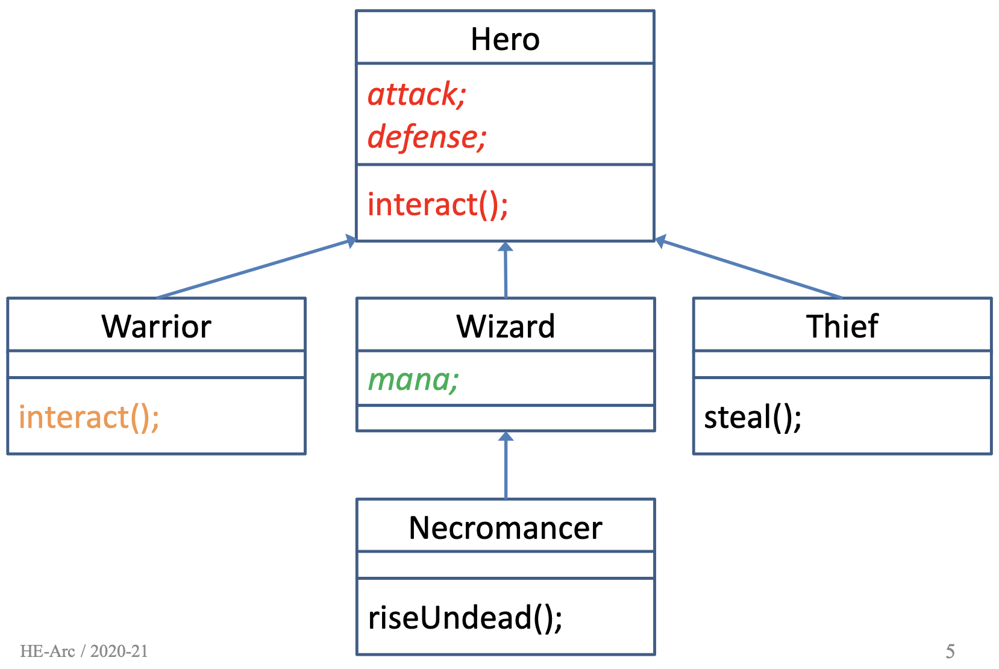

On crée une classe *(classe dérivée, classe fille)* à partir d'une classe existante *(classe de base, classe mère, superclasse)*

La classe dérivée hérite des membres de la classe de base et on peut:
- Ajouter des membres
- Redéfinir des méthodes (spécialiser)

# Généralisation
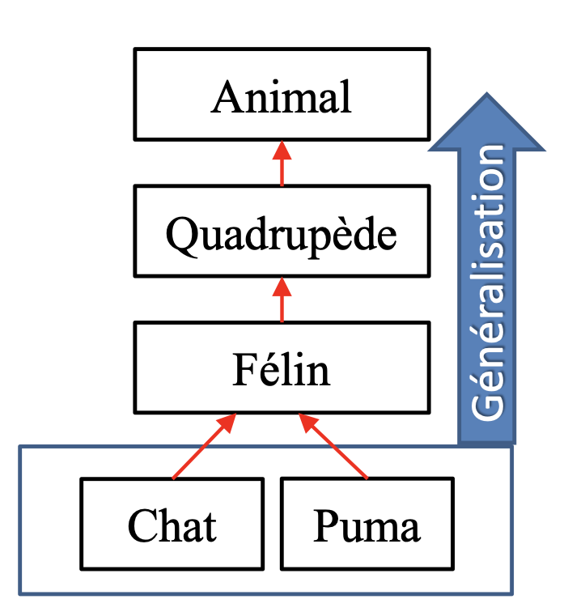

# Spécialisation
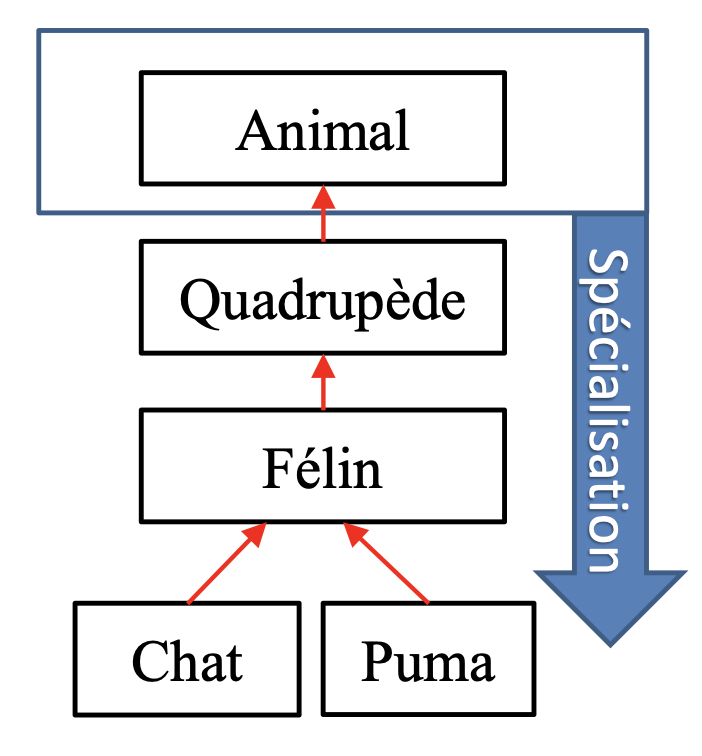


## Composition et Aggrégation
Rélation de type *A* possède n *B* (relation faible ou forte)  

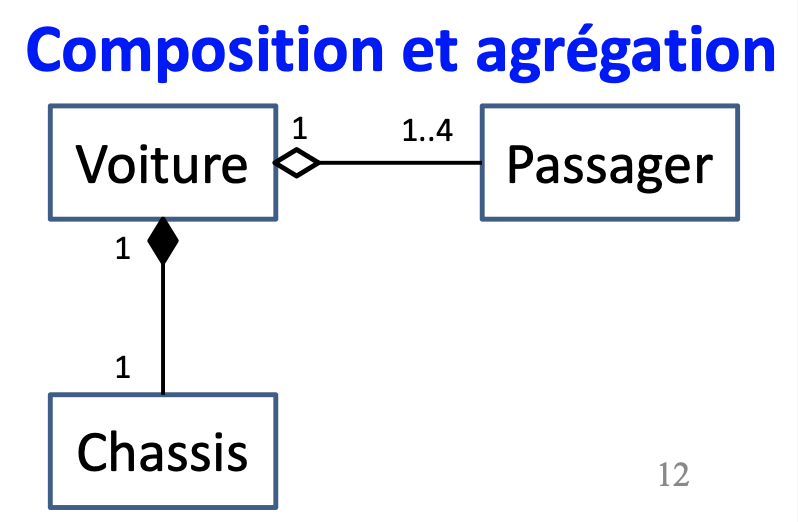

# Composition
Un *Oiseau* a deux *Aile*s et **n'existe pas sans**
**Relation forte**

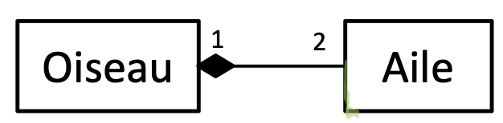

# Aggrégation
Un *Oiseau* a un *Nid* mais **peut exister sans**
**Relation faible**

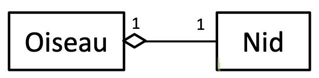

# Héritage
Un *Oiseau* hérite d'un *Animal* car il **est** un *Animal* mais est plus **spécifique**

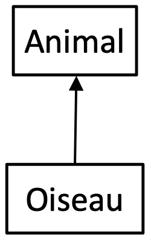

## Exemple
Un cylindre est une spécialisation d'un cercle (un cercle est plus général)

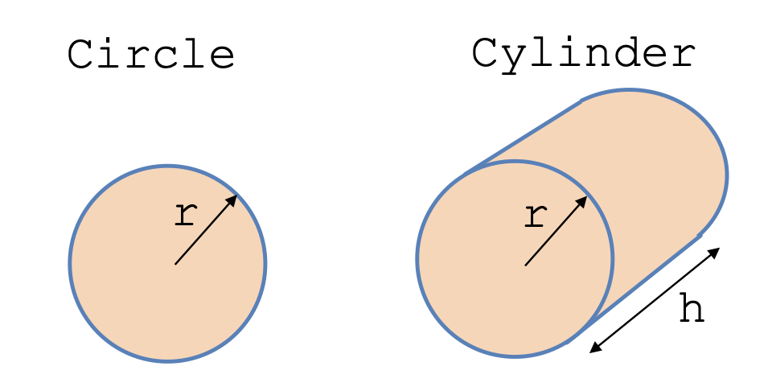

```cpp
class Circle {
  double r;
  
  public:
    double surface();
};

class Cylinder: public Circle {
  // double r;
  double h;
  
  public:
    // double surface();
    double volume();
};
```

# Mode de dérivation


## Public
Les membres conservent leurs accessibilité

```cpp
class Cylinder : public Circle
{
  // ...
};
```

## Private
Les membres `public` et `protected` deviennent `private`

Mode par défaut

```cpp
class Cylinder : Circle
{
  // ...
};
```

```cpp
class Cylinder : private Circle
{
  // ...
};
```

## Protected
Les membres `public` deviennent `protected`

```cpp
class Cylinder : protected Circle
{
  // ...
};
```

# Mode d'accès `protected`
Comme `private` mais les classes fille peuvent y accèder
```cpp
class Circle {
  protected:
    double r;
  
  public:
    Circle(int r);
    double surface();
};

class Cylinder: public Circle {
  double h;
  
  public:
    Cylinder(int r, int h);
    double volume() {
      // Peut accéder à this->r directement
      return 2 * 3.14 * this->r * this->h;
    };
};
```

## UML
Dans un diagramme UML un membre protected est préfixé par `#`

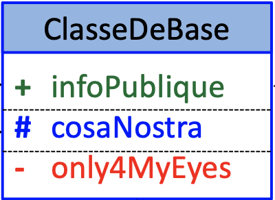

# Constructeur
```cpp
class Circle {
  protected:
    double r;
  
  public:
    Circle(int r);
    double surface();
};

class Cylinder: public Circle {
  double h;
  
  public:
    Cylinder(int r, int h);
    double volume();
};

Circle::Circle(int r)
{
  this->r = r;
}

Cylinder::Cylinder(
  int r,
  int h
) : Circle(r)
// Appel le constructeur de la classe parente
{
  this->h = h;
}
```

## Appel implicite au superconstructeur
Le constructeur parent est appelé implicitement par défaut

```cpp
Cylinder::Cylinder(int r, int h)
{
  // CONSTRUCTEUR PARENT
  // Impossible si r est private
  this->r = r;  

  this->h = h;
}
```

## Appel explicite au superconstructeur
```cpp
Cylinder::Cylinder(int r, int h) : Circle(r)
{
  this->h = h;
}
```

# Overriding
```cpp
class Circle {
  protected:
    double r;
  
  public:
    Circle(int r);
    double surface();
};

class Cylinder: public Circle {
  double h;
  
  public:
    Cylinder(int r, int h);
    double volume();

    // ATTENTION
    // On doit respécifier surface dans la déclaration
    double surface();
};

double Circle::surface()
{
  return 2 * 3.14 * this->r;
}

double Cylinder::surface()
{
  return 2 * 3.14 * this->r * (this->r + this->h);
}
```

# Opérations création/déstruction

## Création
```cpp
Cylinder c(2, 4);
```
1. Allocation de la mémoire
2. Appel du constructeur `Circle()`
3. Appel du constructeur `Cylinder()` 


## Déstruction
```cpp
delete c;
```
1. Appel du déstructeur `~Cylinder()` 
2. Appel du déstructeur `~Circle()`
3. Libération de la mémoire
   
> Processus inversé de la création

# Conversion de classe dérivée en classe de base
Pour savoir si c'est possible, on se passe la question:  

**"le type du membre de droite EST-IL un type du membre de gauche ?"**

```cpp
Animal animal;
Dog dog;
Cat cat;
StrayCat strayCat;

// cat = dog;       Un chien n'est pas un chat
// dog = cat;       Un chat n'est pas un chien
animal = cat;
// cat = animal;    Un animal n'est pas un chat
cat = straycat;
// straycat = cat;  Un chat n'est pas un chat spécial
animal = straycat;
```

## Avec pointeurs
Avec les pointeurs on peut faire cette assignation

**Un chat est un animal**  
Marche de toute façon
```cpp
Cat *cat = new Cat();

Animal *animal = cat;
```

**Un animal n'est pas un chat**  
Ne marcherait pas sans pointeur
```cpp
Animal *animal = new Animal();

// Cast l'Animal en *Cat
Cat *cat = (*Cat)animal;
```

# Fonction virtuelles et polymorphisme

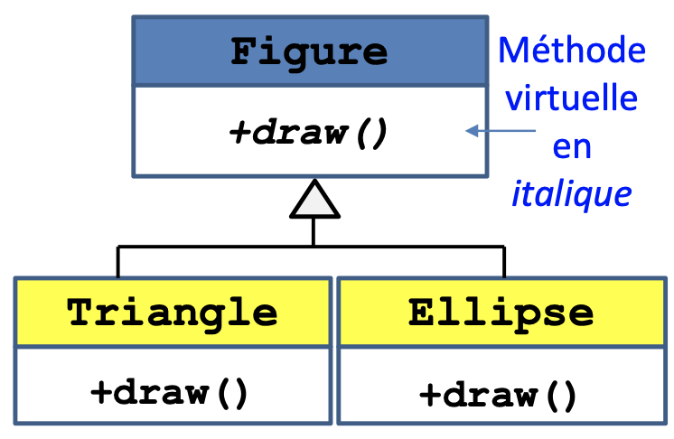

```cpp
class Figure
{
  virtual void draw();
};

class Triangle : public Figure
{
  void draw() override;
}

class Ellipse : public Figure
{
  void draw() override;
}


int main() {
  Figure *figures[3];

  figures[0] = new Triangle();
  figures[1] = new Figure();
  figures[2] = new Ellipse();

  for (int i = 0; i < 3; i++)
  {
    // Appelle la méthode en fonction
    // de la classe de l'instance de image[i]
    image[i]->draw();
  }

  return 0;
}
```

# Polymorphisme
C'est la faculté qu'on les objets de types différents d'avoir des méthodes de même nom mais avec un code différent

Le programmeur n'a pas à se soucier du type de l'objet

Le polymorphisme est implémenté avec le mot clé `virtual`

Pour avoir un comportement polymorphique, les méthodes appelées doivent être `virtual` et les objets doivent être **manipulés avec des pointeurs ou références**

Pour que le polymorphisme soit appliqué, il faut qu'une fonction F soit:
- Membre d'une classe `A`
- Déclarée comme `virtual`
- Redéfinie dans les classes dérivées de `A`
- Appelée à travers des pointeurs ou des références

## Destructeur virtuel
Si une classe a un comportement polymorphe, son destructeur doit être `virtual`

> Sinon risque de memory leak

```cpp
class Point
{
  virtual ~Point()
  {}
};

class NamedPoint : public Point
{
  ~NamedPoint()
  {
    delete []name;
  }
};

int main()
{
  Point *ptr = new NamedPoint();
  delete ptr;

  return 0;
}
```

# Classe abstraite
C'est une classe de base qui est utilisée pour **regrouper les caractéristiques communes** de plusieurs classes

Certaines méthodes peuvent ne pas être implémentées dans une classe de base, mais doivent l'être dans toutes les classes dérivées, ce sont des méthodes **virtuelles pures**

```cpp
virtual void show() = 0;
```

**Une classe contenant au moins une méthode virtuelle pure ne pourra pas être instanciée: classe abstraite**

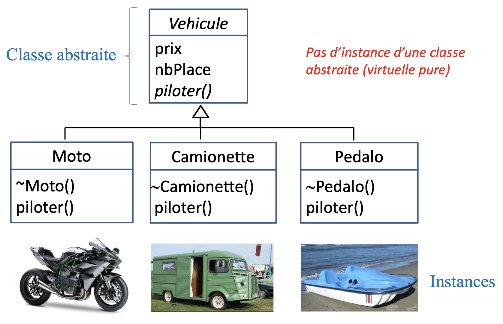

# Référence à la classe de base
```cpp
class A
{
  void show()
  {
    cout << "A"
  }
};

class B: public A
{
  void show()
  {
    cout << "B"
  }
};

int main()
{
  B b;

  // Appel f de la classe de base A
  b.A::f();

  // Appel f de l'objet (classe B)
  b.f();

  return 0;
}
```

# Héritage multiple
Une classe peut avoir plusieurs superclasses

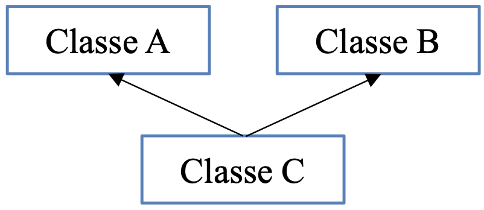

```cpp
class A
{
  int a;

  void f()
  {
    cout << "A::f" << a << endl;
  }

  A(int a) : a(a)
  {
    cout << "init A" << endl;
  }
};

class B
{
  int b;

  void f()
  { 
    cout << "B::f" << b << endl;
  }

  B(int b) : a(b)
  {
    cout << "init B" << endl;
  }
};

// Définit l'ordre d'appel des constructeurs
class C : public B, public A
{
  int c;

  void f()
  {
    cout << "C::f" << c << endl;
  }

  C(int a, int b, int c = 30) : A(a), B(b), c(c)
  {
    cout << "init C" << endl;
  }
};

int main()
{
  C c(10, 20);

  c.A::f();
  c.B::f();
  c.f();

  return 0;
}
```

```
init B
init A
init C
A::f 10
B::f 20
C::f 30
```
> On voit l'ordre d'appel des constructeur qu'on a définit, B puis A

# Héritage virtuel
## Problème
Comment faire si une classe hérite de deux classes `A` et `B` héritant toutes les deux de la même classe `R`

Cela cause une erreur car comment accédons aux membres de `R` ?


**Code cause l'erreur**
```cpp
class R
{
  void show()
  {
    cout << "R::show"
  }
};

class A: public R
{
};

class B: public R
{
};

class C: public A, public B
{
};
```

**Essai 1**
```cpp
int main()
{
  C c;

  c.show();

  return 0;
}
```
```
error rquest for membre show is ambigous
```

**Essai 2**
```cpp
int main()
{
  C c;

  c.R::show();

  return 0;
}
```
```
error 'R' is an ambigous base of C
```

## Solution

`A` et `B` héritent **virtuellement** de la classe `R`

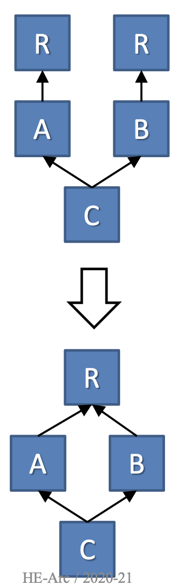

```cpp
class R
{
  int r;

  R(int r): r(r)
  {
    cout << "init R";
  }

  void show()
  {
    cout << "R::show r=" << r << endl;
  }
};

// On ajoute le mot clé virtual
class A: virtual public R
{
  int a;

  A()
  {
    cout << "init A" << endl;
  }
};

// On ajoute le mot clé virtual
class B: virtual public R
{
  int b;

  B()
  {
    cout << "init B" << endl;
  }
};

class C: public B, public A
{

  C(int r) : A(), B(), R(r)
  {
    cout << "init C" << endl;
  }
};

int main()
{
  C c(10);
  c.show();

  return 0;
}
```

```
init R
init B
init A
init C
R::show r=10
```
